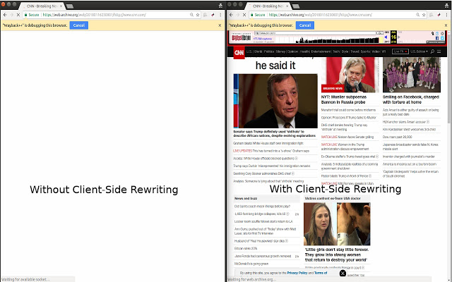

# Wayback++

### Client-side rewriting for the Internet Archive's Wayback Machine



For more information about why this is necessary please read the following two blog posts from the [Web Science and Digital Libraries Research Group](http://ws-dl.blogspot.com/)  
* [CNN.com has been unarchivable since November 1st, 2016](http://ws-dl.blogspot.com/2017/01/2017-01-20-cnncom-has-been-unarchivable.html)
* [A State Of Replay or Location, Location, Location](http://ws-dl.blogspot.com/2017/03/2017-03-09-state-of-replay-or-location.html)

#### Distributed as an browser extension
* [Chrome](https://chrome.google.com/webstore/detail/wayback%20%20/kcpoejoblnjdkdfdnjkgcmmmkccjjhka)
* [Firefox](https://addons.mozilla.org/en-US/firefox/addon/waybackplusplus/)

#### Packaging
Package for both Chrome and Firefox
```sh
yarn run build
```

Package for Chrome
```sh
yarn run build-chrome
```

Package for Firefox
```sh
yarn run build-firefox
```

Be sure to install the dependencies first.

Dependencies only required for automated packaging.

#### Icons
Shout out to [willcdotca](https://github.com/willcdotcagi) for creating the icons.
Much appreciated. 
